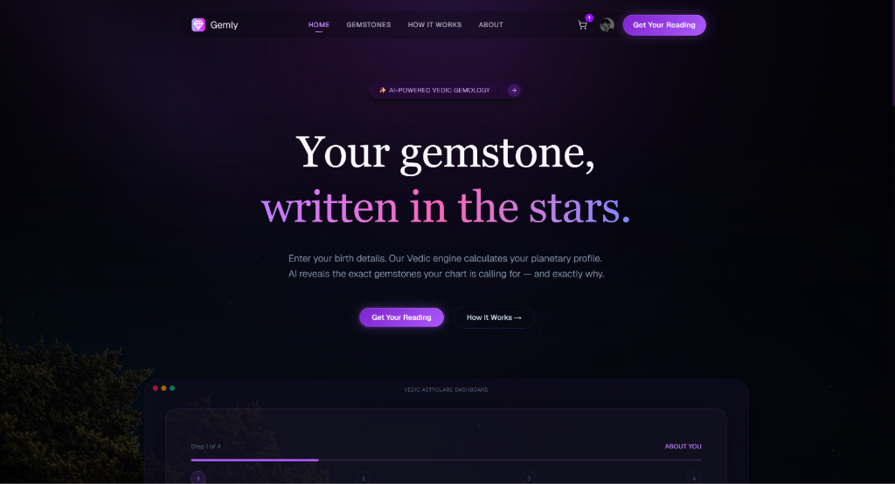

# Gemly ✨ — Your Gemstone, Written in the Stars

> **AI-powered Vedic gemstone recommendation platform.**  
> Enter your birth details → Vedic engine calculates your planetary profile → AI recommends your sacred gemstones and explains exactly why.

🌐 **Domain:** [gemly.app](https://gemly.app)  
 *"Your gemstone, written in the stars."*

---



---

## What is Gemly?

Gemly combines classical Vedic astrology (Jyotish) with a modern AI language model to give personalized gemstone recommendations rooted in Ratna Shastra (gemstone scripture). Unlike rule-based tools that return the same gem for everyone with the same sun sign, Gemly accounts for:

- Your **Rashi** (Moon sign) and estimated **Lagna** (Ascendant)
- Your current **Vimshottari Dasha** period (active planetary cycle)
- Your **weak and benefic planets** based on Parashari rules
- Your stated **life concern** (career, love, health, wealth, protection, spiritual)

| Problem (competitors) | Solution (Gemly) |
|---|---|
| Static rule-based logic | AI reasoning via OpenRouter (Gemma) |
| No explanation of WHY | Personalized "why this gem for your chart" |
| Same result for same DOB | Concern-based + Dasha-aware personalization |
| Hallucinated / broken gem links | Slug whitelist enforced at prompt + server level |
| Cluttered outdated UI | Dark glassmorphic design with Aceternity Lens effects |
| Not mobile optimized | Fully responsive Next.js 15 app |

---

## Architecture

```
gemly/
├── frontend/           Next.js 15 (App Router) + Vanilla CSS + Framer Motion
│   └── src/
│       ├── app/
│       │   ├── page.tsx                  # Homepage — hero + recommendation form
│       │   ├── layout.tsx                # Root layout (Clerk, fonts, metadata)
│       │   ├── globals.css               # Full design system
│       │   ├── gemstones/
│       │   │   ├── page.tsx              # Gemstone encyclopedia grid (24 gems)
│       │   │   └── [slug]/page.tsx       # Individual gemstone detail page
│       │   ├── how-it-works/page.tsx     # Process explanation
│       │   └── about/page.tsx            # Brand story + AI disclosure
│       ├── components/
│       │   ├── Navbar.tsx                # Sticky glassmorphic nav with cart
│       │   ├── Footer.tsx                # Site footer
│       │   ├── RecommendationForm.tsx    # Multi-step form + AI result grid
│       │   ├── GemstoneDetailClient.tsx  # Client-side detail page component
│       │   ├── CartDrawer.tsx            # Slide-in cart panel
│       │   ├── FeaturesSection.tsx       # Competitor comparison section
│       │   ├── hero-section.tsx          # Hero with animated text
│       │   └── ui/                       # Aceternity UI primitives (Lens, etc.)
│       ├── context/
│       │   └── CartContext.tsx           # Global cart state (React Context)
│       └── lib/
│           └── utils.ts                  # cn() helper + getCdnUrl()
│
└── backend/            Node.js + Express REST API (ESM)
    └── src/
        ├── index.js                      # Server entry — Express + Clerk middleware
        ├── routes/
        │   ├── recommend.js              # POST /api/recommend
        │   └── gemstones.js              # GET /api/gemstones[/:slug]
        ├── controllers/
        │   ├── recommendController.js    # Zod validation → Vedic → AI → response
        │   └── gemstoneController.js     # Static encyclopedia data
        └── services/
            ├── vedicEngine.js            # Deterministic Vedic planetary calculator
            └── aiService.js              # OpenRouter streaming AI + slug whitelist
```

---

## Tech Stack

| Layer | Technology |
|---|---|
| Frontend Framework | Next.js 15 (App Router) |
| Styling | Vanilla CSS / Tailwind CSS v4 (CSS-first config) |
| Animations | Framer Motion + Aceternity UI (Lens, Rays, Beams) |
| Language | TypeScript (frontend) / JavaScript ESM (backend) |
| Auth | Clerk (`@clerk/nextjs` + `@clerk/express`) |
| Backend | Node.js + Express |
| AI Provider | OpenRouter (`google/gemma-4-31b-it:free` default) |
| Streaming | OpenAI-compatible streaming via `openai` SDK |
| Validation | Zod |
| CDN | External CDN for gemstone images (`NEXT_PUBLIC_CDN_URL`) |
| Font | Inter (300, 400 weights via Google Fonts) |

---

## How the AI Pipeline Works

```
User Form Input
      │
      ▼
recommendController.js  ← Zod schema validation
      │
      ▼
vedicEngine.js          ← Deterministic Vedic calculations
  • Parse Rashi from zodiac string
  • Estimate Lagna (Ascendant) from birth time
  • Calculate current Vimshottari Dasha lord + years remaining
  • Determine weak planets (debilitation rules)
  • Map benefics by Lagna (Parashari)
  • Map concern → relevant planets
      │
      ▼
aiService.js            ← OpenRouter streaming call
  • System prompt: injects VALID_GEMSTONE_SLUGS whitelist (24 slugs)
  • Instructs AI to return slug field matching platform slugs ONLY
  • Streams response chunks, separates reasoning from content
  • Parses JSON, filters out any gem with an invalid slug (safety net)
      │
      ▼
Response → RecommendationForm.tsx
  • Renders result grid (2-column max) using RecommendedGemstoneGridCard
  • Each card links to /gemstones/[slug] using the AI-provided slug
```

---

## Running Locally

### Prerequisites

- Node.js ≥ 18
- An [OpenRouter](https://openrouter.ai) API key
- A [Clerk](https://clerk.com) account (publishable + secret key)

### 1. Backend

```bash
cd gemly/backend

# Copy environment template
cp .env.example .env
# Edit .env — fill in your keys (see table below)

npm install
npm run dev          # Runs on http://localhost:4000
```

Health check: `GET http://localhost:4000/health`

### 2. Frontend

```bash
cd gemly/frontend

# Create .env.local
cp .env.example .env.local
# Edit .env.local — fill in your keys

npm install
npm run dev          # Runs on http://localhost:3000
```

---

## Environment Variables

### Backend (`backend/.env`)

| Variable | Required | Description |
|---|---|---|
| `OPENROUTER_API_KEY` | ✅ Yes | OpenRouter API key (openrouter.ai) |
| `OPENROUTER_MODEL` | Optional | Model override (default: `google/gemma-4-31b-it:free`) |
| `CLERK_SECRET_KEY` | ✅ Yes | Clerk secret key from dashboard |
| `PORT` | Optional | Server port (default: `4000`) |
| `FRONTEND_URL` | Optional | CORS allowed origin(s), comma-separated |

### Frontend (`frontend/.env.local`)

| Variable | Required | Description |
|---|---|---|
| `NEXT_PUBLIC_API_URL` | ✅ Yes | Backend API URL (e.g. `http://localhost:4000`) |
| `NEXT_PUBLIC_CDN_URL` | ✅ Yes | CDN base URL for gemstone images |
| `NEXT_PUBLIC_CLERK_PUBLISHABLE_KEY` | ✅ Yes | Clerk publishable key |
| `CLERK_SECRET_KEY` | ✅ Yes | Clerk secret key (server-side Next.js) |

---

## API Reference

### `POST /api/recommend`

Returns AI-powered gemstone recommendations based on birth data.

**Request body:**
```json
{
  "name": "Arjun Sharma",
  "dob": "1990-05-15",
  "birthTime": "14:30",
  "birthPlace": "Mumbai, India",
  "zodiac": "Taurus (Vrishabha)",
  "concern": "career"
}
```

| Field | Type | Required | Values |
|---|---|---|---|
| `name` | string | ✅ | 1–100 chars |
| `dob` | string | ✅ | `YYYY-MM-DD` |
| `birthTime` | string | Optional | `HH:MM` (24h) |
| `birthPlace` | string | ✅ | City, Country |
| `zodiac` | string | ✅ | Any Vedic zodiac string |
| `concern` | string | ✅ | `career` `love` `health` `wealth` `protection` `spiritual` |

**Response `200 OK`:**
```json
{
  "gemstones": [
    {
      "slug": "emerald",
      "name": "Emerald",
      "sanskrit": "Panna",
      "planet": "Mercury",
      "color": "#059669",
      "tagline": "...",
      "why_recommended": "...",
      "properties": ["Intelligence", "Business", "Communication"],
      "how_to_wear": "...",
      "best_day": "Wednesday",
      "caution": "..."
    }
  ],
  "personal_message": "Arjun, your chart shows...",
  "_meta": {
    "model": "google/gemma-4-31b-it:free",
    "reasoningChars": 1240,
    "profile": {
      "rashi": "Taurus",
      "dashaLord": "Mercury",
      "weakPlanets": ["Saturn"]
    }
  }
}
```

### `GET /api/gemstones`

Returns the full gemstone catalog (24 entries).

### `GET /api/gemstones/:slug`

Returns a single gemstone by slug.

### `GET /health`

Returns API status, model, and key configuration.

---

## Pages

| Route | Description |
|---|---|
| `/` | Homepage — hero, multi-step recommendation form |
| `/gemstones` | Gemstone encyclopedia grid (24 gems, Lens hover effect) |
| `/gemstones/[slug]` | Individual gemstone detail with images, Vedic data, ordering |
| `/how-it-works` | Step-by-step process explanation |
| `/about` | Brand story + AI disclosure |

---

## Gemstone Catalog (24 gems)

| Slug | Gem | Planet |
|---|---|---|
| `cats-eye` | Cat's Eye (Lehsuniya) | Ketu |
| `pearl` | Pearl (Moti) | Moon |
| `white-pukhraj` | White Pukhraj | Venus |
| `ceylon-pukhraj` | Ceylon Pukhraj | Jupiter |
| `peetambari-neelam` | Peetambari Neelam | Jupiter & Saturn |
| `ceylon-neelam` | Ceylon Neelam | Saturn |
| `neelam` | Neelam (Blue Sapphire) | Saturn |
| `emerald` | Emerald (Panna) | Mercury |
| `burmese-ruby` | Burmese Ruby | Sun |
| `ruby` | Ruby (Manikya) | Sun |
| `australian-fire-opal` | Australian Fire Opal | Venus |
| `fire-opal` | Fire Opal | Venus |
| `blue-topaz` | Blue Topaz | Saturn/Venus |
| `white-topaz` | White Topaz | Venus |
| `natural-zircon` | Natural Zircon | Venus |
| `zirconia` | Zirconia | Venus |
| `garnet` | Garnet | Mars/Rahu |
| `lapis-lazuli` | Lapis Lazuli | Saturn |
| `turquoise` | Turquoise | Jupiter/Venus |
| `moonstone` | Moonstone | Moon |
| `amethyst` | Amethyst | Saturn |
| `citrine` | Citrine | Jupiter |
| `tiger-eye` | Tiger Eye | Sun/Mars |
| `african-ruby` | African Ruby | Sun |

---

## Design System

Dark glassmorphic aesthetic inspired by Stripe and Aceternity:

| Token | Value |
|---|---|
| Background | `#0a0a0f` |
| Surface cards | `rgba(255,255,255,0.04)` frosted glass |
| Primary gradient | `linear-gradient(135deg, #7c3aed, #a855f7)` |
| Text primary | `#f8f8ff` |
| Text muted | `#94a3b8` |
| Border | `rgba(139,92,246,0.2)` |
| Font | Inter 300/400 |
| Card effect | Aceternity `<Lens>` hover magnification + SVG Rays + Beams |

---

## AI Usage

See [AI_USAGE.md](./AI_USAGE.md) for the full AI disclosure.

**Summary:**
- **Provider:** OpenRouter
- **Default model:** `google/gemma-4-31b-it:free`
- **Purpose:** Vedic gemstone reasoning and personalized recommendation
- **Input:** Enriched planetary profile from `vedicEngine.js`
- **Output:** Structured JSON with 2–3 gemstone recommendations + personal message
- **Slug safety:** AI is given the exact 24-slug whitelist in the system prompt. Server also filters any invalid slug from the response.

---

## License

Private — All rights reserved. © 2026 Gemly.
